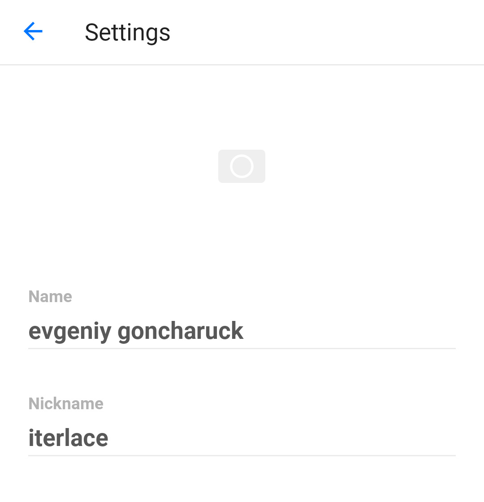

# Must to Letterboxd Exporter

## Python

### Version
Since dataclasses are used, **the lowest version supported is Python 3.7**
### Packages
Before running, you need to install `requests` library:
```bash
$ python3 install requests
```

## Usage
Just provide a Must username. The rest is ours.



```bash
$ python3 main.py

Enter your Must username: iterlace

Exported Want list to /tmp/must2letterboxd/want.csv
Exported Watched list to /tmp/must2letterboxd/want.csv
```
